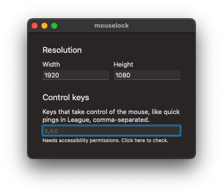

<h1 align="center">
  mouselock
</h1>

  
   
  Lock mouse cursor to a centered area of the screen for MacOS.
   
  

## Why?

In League of Legends (and potentially other games), the cursor is not locked properly in borderless mode. This app tries to fix that.

## Requirements

Requires MacOS 11.0 or later.

## Tips

- Get [LinearMouse](https://linearmouse.org) to remove mouse acceleration.
- Enable [MetalBetaTest](https://www.reddit.com/r/LeaguePBE/comments/jgzjg1/mac_on_metal_beta_testing) for League of Legends to get better performance.